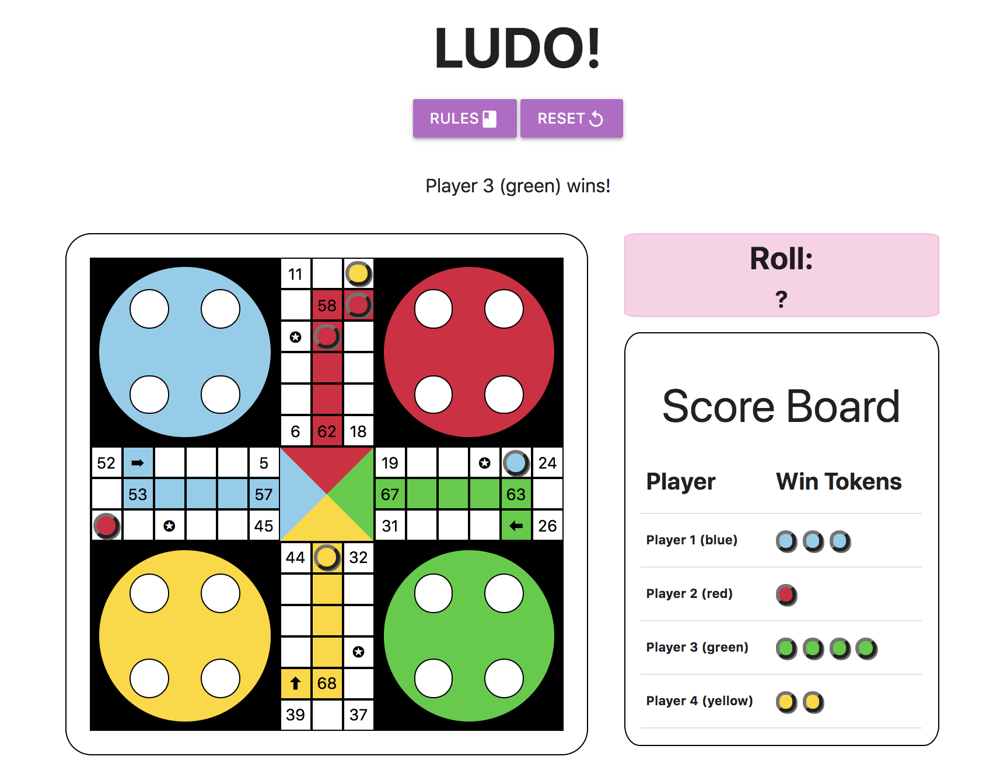

# 🎲 ludo

## Description

Ludo is a multi-player board game that takes a combination of luck and skill to win! To win the game, a player needs to be the first to get all four of their tokens to the winning tile.

This game uses Javascript, jQuery, HTML5, and CSS3.

 

 

#### Accessing the game:

**Link:** https://yboodhan.github.io/ludo/

To install this game, fork this repository. Click clone and copy the HTTPS link. Open terminal and run `git clone *insert HTTPS link here*`. Access the repository by changing directory accordingly (`cd ludo`) and running `open index.html`.

## Approach

A combination of making notes by hand, using comments throughout the process, using a ToDo file, and using Trello was implemented in order to track workflow and tasks.

* Wireframes were created and used as a guide to complete HTML and CSS components for game. HTML and CSS were used to created the DOM elements for the game and to style these elements, respectively.

 

* DOM manipulation and game logic were implemented simultaneously in an iterative process. HTML and CSS were revised as needed to preserve style during this process.
  * Logic for the game overall was broken down to smaller pieces (start logic, play logic, change turn logic, move logic, win logic, score logic, etc.).
  * Writing each function was approached using DRY code (e.g. utilized a class to create token objects and functions, used functions/loops to apply repeating tasks).
  * Each logic piece was written using a function or series of functions.
     * Used MDN, jQuery, W3schools to learn new methods or about built in functions.
  * Errors in logic were detected by playing the game and utilizing console.log and other development tools.
  * Code was revised and made DRY.
  * Changes were committed after each iteration and completion of piece of logic that passed testing.

* A complete revision of code was done to remove any useless lines of code, remaining console.log lines, any unused variables, and any lingering comments as well as to format code to ensure readability. Final touches were made to HTML and CSS files of the fully functional game.

* The `readme.md` file was edited to summarize process.

## Further Goals

In order to get the desired stepping effect, I used a stepTimeout. However, since JS is asynchronous, this created some obstacles and bugs. Some functions would run and use variables that haven't been updated yet. To work around this issue, test functions were created to feed the true value for the location of the tokens to the necessary functions. A resulting bug is that when removing an opponent token, the opponent token is removed before the player gets to the tile. The game works as intended and removes tokens correctly but the effect is weird and does not offer the best user experience.

This ludo game is fully functional and can be reset using the RESET button in the game. Still, this game can be improved by allowing a two-player mode and a player vs. AI mode. In addition, additional features like allowing the user to input player names and music or sounds can add to the appeal of the game. If given more time, these features would have been incorporated.

